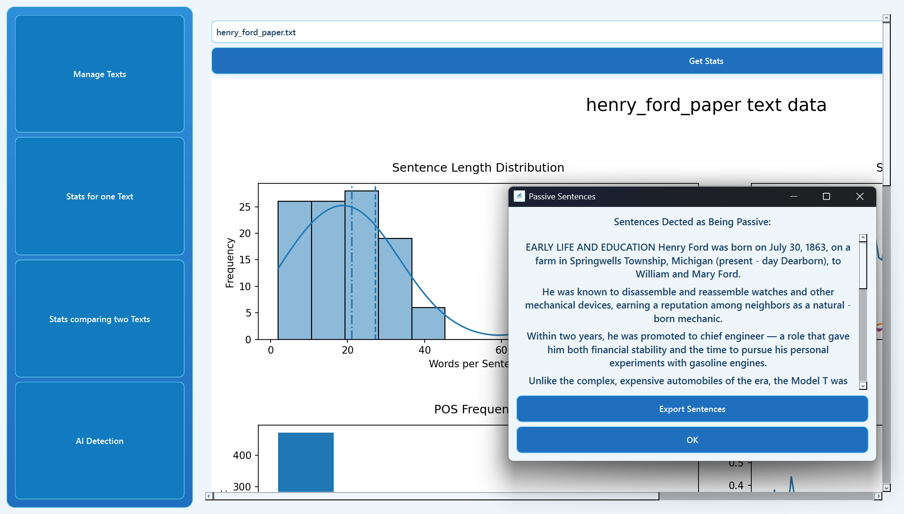

# StyloMind

A desktop app I built to help writers (and myself) review papers with useful structure, style, and writing-stat feedback.



## Overview

StyloMind lets you upload writing samples, store them locally, and analyze them from different angles.

You can:
- Compare two texts for **structure similarity** and **style similarity**
- Generate a detailed **single-text writing dashboard**
- Flag likely **passive voice** and **1st/2nd-person usage**
- Export flagged sentences for revision work

## Features

- Upload support for `.txt`, `.pdf`, and `.docx`
- Local SQLite-backed text storage
- Structure similarity scoring using NLP features + TF-IDF
- Style similarity scoring using token features + character n-grams
- Single-text analytics charts (sentence length, POS density, lexical diversity, POV trends, and more)
- Two-text comparison chart with percentage similarity output

## Tech Stack

- Python
- PySide6 (desktop UI)
- spaCy (`en_core_web_sm`) for NLP parsing
- scikit-learn for similarity scoring
- Matplotlib + Seaborn for visualizations
- pandas for chart data prep
- SQLite3 for local storage
- pdfplumber and python-docx for file ingestion

## Project Structure

```text
StyloMind/
|-- main.py
|-- assets/
|   |-- logo.png
|   |-- preview.png
|   `-- styles.css
|-- database/
|   |-- database.py
|   `-- StyloMind.db
|-- services/
|   |-- learn.py
|   `-- data/
`-- ui/
    |-- main_window.py
    |-- pages/
    `-- widgets/
```

## Requirements

- Python `3.12` or `3.13`
- `pip`

Do not use Python `3.14+` yet. spaCy currently depends on behavior that can break on 3.14 and cause config errors.

## Installation (Windows PowerShell)

```powershell
py -3.13 -m venv .venv
.\.venv\Scripts\Activate.ps1
python -m pip install --upgrade pip
pip install pyside6 spacy scikit-learn matplotlib seaborn pandas pdfplumber python-docx
python -m spacy download en_core_web_sm
```

If `py` is unavailable, call your Python 3.13 executable directly:

```powershell
& "C:\Path\To\Python313\python.exe" -m venv .venv
```

## Run

```powershell
.\.venv\Scripts\Activate.ps1
python main.py
```

## App Pages

- **Upload Page**: import files, list saved texts, and delete saved entries
- **One Text Stats Page**: view deep writing metrics and revision-focused popups
- **Two Text Stats Page**: compare two texts for style/structure similarity percentages

## Troubleshooting

1. `OSError: [E050] Can't find model 'en_core_web_sm'`
- Run:

```powershell
python -m spacy download en_core_web_sm
```

2. spaCy/pydantic config errors on newer Python
- Recreate your venv with Python `3.12` or `3.13`, then reinstall dependencies.

## Roadmap

- Add a web version alongside the desktop app
- Improve AI-detection comparison quality
- Continue polishing stats clarity and export options

## License

No license file is currently included in this repository.
